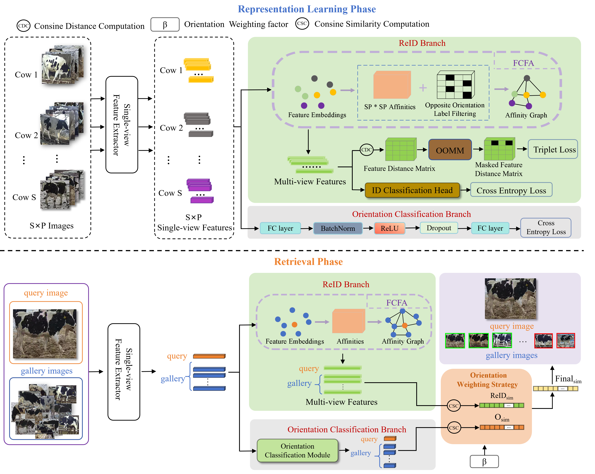

# Dairy-Cow-Re-Identification
Dairy cow re-identification across multi-camera views via complementary-view feature fusion and orientation-aware learning
## 🔥 Overview
<p align="center">
  
</p>  

## 1️⃣ Data
To find the dataset used in this study, please make sure all files are downloaded from [here](https://pan.baidu.com/s/1g81o3IBowflN-Co7IkB6mA)  
Extraction code：please email at bsdai@neau.edu.cn  
### 📁 Dataset Structure
```text
Dairy-Cow-Re-Identification/
├── data_train/
│   ├── 0000/
│   │   └── images/
│   │       ├── 0000_c0_0001_0.jpg
│   │       ├── 0000_c3_0123_2.jpg
│   │       └── ...
│   ├── 0001/
│   │   └── images/
│   │       └── ...
│   └── ...
├── test/
│   ├── 0053/
│   │   └── images/
│   │       └── ...
│   ├── 0054/
│   │   └── images/
│   │       └── ...
│   └── ...
├── list_train.txt
├── list_val.txt
├── list_query.txt
├── list_gallery.txt
└── text-description-MLLM/
    ├── train_text.json
    ├── test_text.json
  
图片的命名格式为CowID_cameraID_num_orientation.jpg
其中train_text.json和test_text.json是由MLLM对每张图片生成的文本描述
```
## 2️⃣ Results
The experimental results are as below.

| Method | Rank-1/% | Rank-5/% | Rank-10/% | mAP/% | mAP-IOPS/% |
|:--:|:--:|:--:|:--:|:--:|:--:|
| FOONet | 96.9 | 98.5 | 100.0 | 47.3 | 75.9 |

